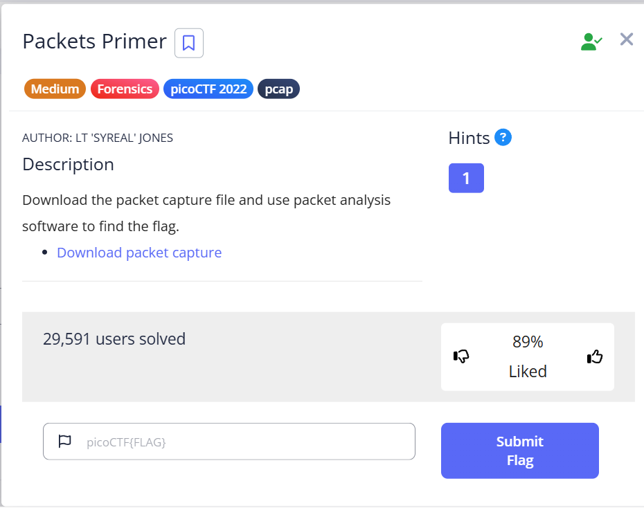
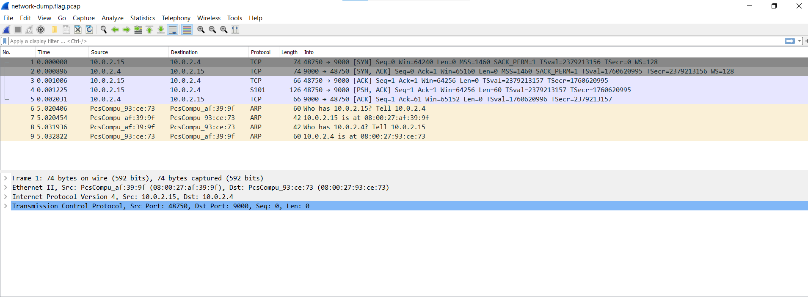
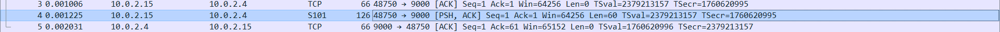
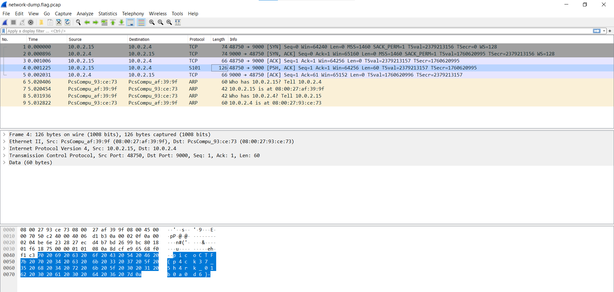

# Packets Primer

## Description

Download the packet capture file and use packet analysis software to find the flag.

---

## Solution

Here we are given a file which we have to analyze and find the flag.

After downloading the given file we open it in wireshark.

Upon analyzing the content closely we can observe one frame with `[PSH | ACK]` signifying some data is being pushed.

Upon clicking this frame the flag will be displayed 

